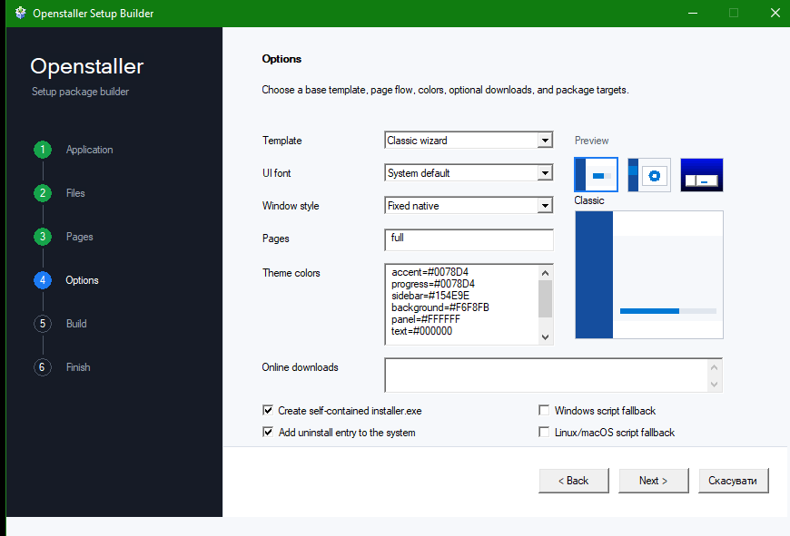
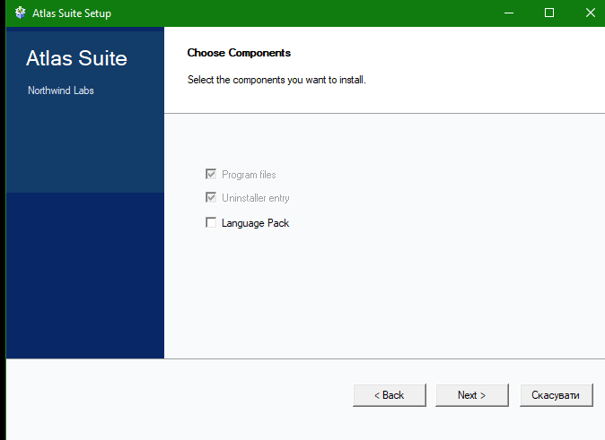
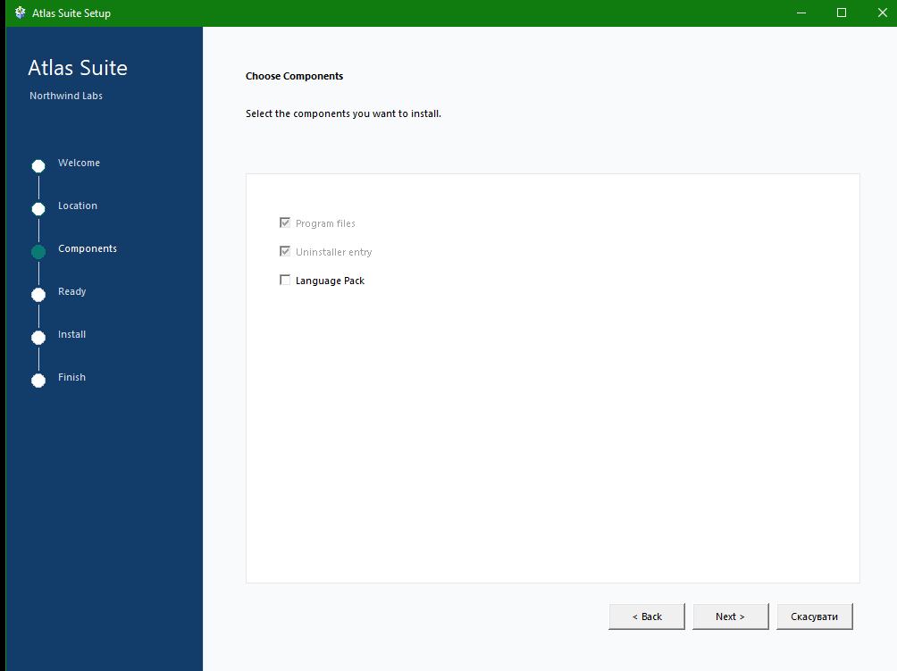
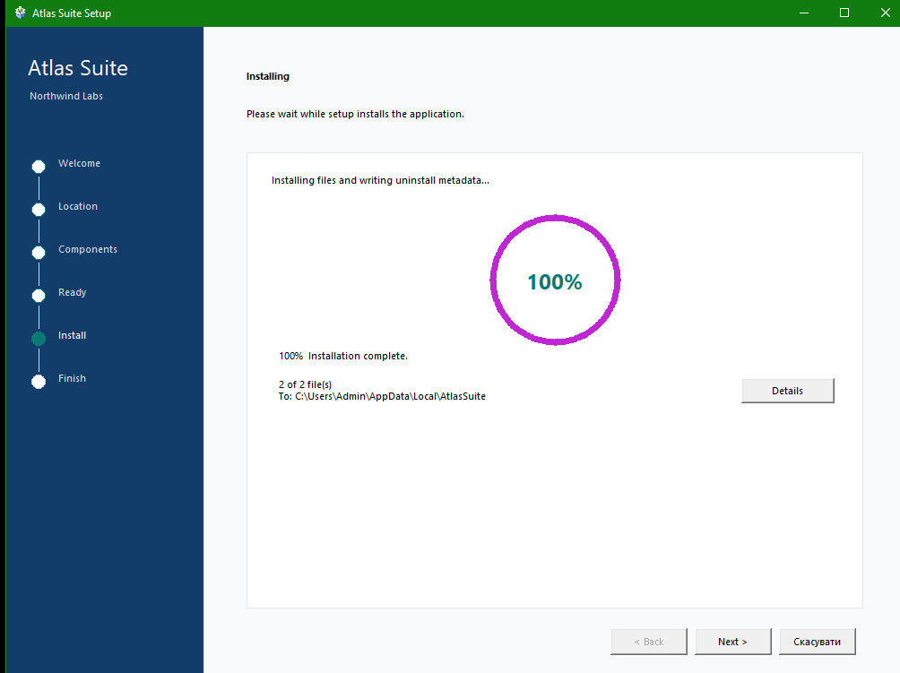
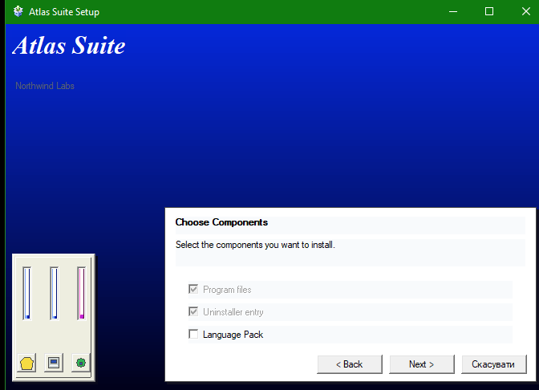

# Openstaller

<p align="center">
  
</p>

<p align="center">
  <strong>Native C / Assembly installer and uninstaller generator.</strong>
</p>

Openstaller builds setup packages for desktop software. It takes a payload
directory, product metadata, optional license text, wizard copy, side artwork,
background artwork, executable icons, optional online components, theme colors,
and page-flow settings, then produces a branded installer package.

The project is written in C with a real Assembly identity kernel on supported
x86_64 builds. Assembly is used in the package identity path, not as decoration:
the generated installer ID depends on the payload, product metadata, and install
configuration.

Openstaller is currently alpha-stage software. It is usable for experiments,
internal tools, small projects, and contributor work, but it should be reviewed
and signed before being used for production distribution.

## Screenshots

| Setup builder | Classic installer |
| --- | --- |
|  |  |

| Modern installer | Modern progress |
| --- | --- |
|  |  |

| Legacy installer |
| --- |
|  |

## What It Builds

On Windows, Openstaller can generate:

```text
dist/<product>-<version>/
  installer.exe
```

The generated installer contains the payload archive, manifest, optional license
text, optional wizard artwork, icon resources, version metadata, and the native
uninstaller executable. During installation, the uninstaller is written into the
installed application folder and all system uninstall entries point to that
installed copy. Wizard artwork can include both the classic side panel image and
an optional page background image. Online components are stored as manifest
entries and downloaded by the generated installer when the user selects them.
Fallback scripts can be emitted separately when a project wants readable
`install.bat`, `uninstall.bat`, `install.sh`, or `uninstall.sh` files.

The default generated installer uses a classic wizard flow:

1. Welcome
2. License, when configured
3. Install location
4. Component summary
5. Progress
6. Finish

The component page can include optional HTTP/HTTPS downloads. This is intended
for large extras such as models, sample packs, asset bundles, or language data
hosted on direct Dropbox, Hugging Face, GitHub release, or ordinary CDN URLs.

Generated installers can use `classic`, `modern`, or `legacy` style. Classic is
the default compact wizard. Modern uses a clean sidebar layout, card-like
content area, selectable UI font, resizable native window, and circular progress
view. Legacy uses a full-screen old-setup layout with a large product title,
background artwork, and a bottom-right progress panel.

Those three templates stay as the structural base. The package can override
accent, progress, sidebar, panel, text, and legacy gradient colors without
turning the installer into a free-form skin that breaks native behavior. The
page flow can also be shortened, for example to skip the welcome page or use a
compact location-ready-progress flow.

The embedded uninstaller has its own wizard and removes the same registration
metadata written by the installer.

## Current Capabilities

- Native Win32 setup builder GUI.
- Command-line package generator.
- Self-contained Windows `installer.exe` output with the uninstaller embedded
  and installed into the target application folder.
- Embedded payload archive and package manifest.
- Optional deflate compression when zlib is available.
- Product-specific Windows version resources.
- Custom installer and uninstaller `.ico` files.
- Built-in default installer/uninstaller icons.
- Custom wizard side artwork and page background artwork.
- Custom page text for generated installer pages.
- Configurable page flow based on the selected template.
- Theme colors for the selected template, including legacy gradient colors.
- Optional license acceptance page.
- Windows uninstall registration under the current user.
- Windows Start Menu shortcuts for the installed app and uninstaller.
- Linux registration metadata under the XDG data directory.
- macOS registration metadata under `~/Library/Application Support/Openstaller`.
- Linux `.desktop` launcher generation when a launcher path is configured.
- macOS command launchers under `~/Applications`.
- UAC relaunch for protected Windows install locations.
- Rollback for failed installs, including updates over existing files.
- Runtime progress events with current file, destination path, and expandable
  install log.
- Optional online components with installer checkboxes and rollback-aware
  download installation.
- Selectable generated installer style: classic wizard, modern suite, or legacy
  full-screen.
- Selectable generated UI font and window behavior.
- C API shared by the GUI and CLI.
- x86_64 Assembly hash backend with a C fallback.
- GitHub CI for Windows, Linux, and macOS.
- Tag-based GitHub release workflow with optional Authenticode signing secrets.

## Windows Compatibility

Default Windows builds target the current supported desktop baseline:

```text
Windows 7 SP1 x64 or newer
Recommended: Windows 10/11 x64
```

Openstaller also includes a legacy compatibility build mode for older Win32
systems:

```text
Windows 2000 or newer, 32-bit Win32 target
```

Legacy mode is enabled with:

```text
OPENSTALLER_WIN2000_COMPAT=ON
```

That mode:

- sets `WINVER`, `_WIN32_WINNT`, `_WIN32_IE`, and `NTDDI_VERSION` to the Windows
  2000 API floor;
- links Windows executables with subsystem version `5.00` when the toolchain
  supports it;
- disables UAC/elevation relaunch code, because Windows 2000 does not have the
  Vista UAC security model;
- avoids `RegDeleteTreeA` and uses recursive registry deletion through older
  registry APIs;
- can be combined with `OPENSTALLER_FORCE_C_HASH=ON` for legacy 32-bit builds.

Convenience build:

```bat
scripts\build-windows.bat win2000
```

Manual build:

```bat
cmake -S . -B build-win2000 -G "MinGW Makefiles" ^
  -DOPENSTALLER_WIN2000_COMPAT=ON ^
  -DOPENSTALLER_FORCE_C_HASH=ON
cmake --build build-win2000
```

Windows 2000 support depends on the compiler runtime as much as the Win32 API.
Use a legacy-capable 32-bit MinGW/MSVCRT toolchain for actual Windows 2000
binaries. Modern MSVC 2022 binaries generally require a newer Windows runtime
even if the source is compiled with the Windows 2000 API floor.

## Build

### Windows

```bat
scripts\build-windows.bat
```

Manual CMake build:

```bat
cmake -S . -B build
cmake --build build
ctest --test-dir build -C Debug --output-on-failure
```

Windows builds produce:

```text
openstaller.exe
openstaller-cli.exe
openstaller-runtime.exe
```

`openstaller.exe` is the native builder GUI. `openstaller-cli.exe` is the
scriptable generator. `openstaller-runtime.exe` is the Win32 runtime template
used for generated installer and uninstaller executables.

### Linux and macOS

```sh
sh scripts/build-unix.sh
```

Manual CMake build:

```sh
cmake -S . -B build
cmake --build build --parallel
ctest --test-dir build --output-on-failure
```

The portable C core and CLI build on Unix-like systems. The Win32 GUI and Win32
runtime are only built on Windows.

## Command-Line Usage

Minimal package:

```bat
build\Debug\openstaller-cli.exe ^
  --name "Telemetry Workbench" ^
  --company "Example Instruments" ^
  --version 1.0.0 ^
  --source examples\sample_payload ^
  --output dist ^
  --install-dir "%LOCALAPPDATA%\TelemetryWorkbench"
```

Branded package with license, wizard art, icons, and launcher metadata:

```bat
build\Debug\openstaller-cli.exe ^
  --name "Telemetry Workbench" ^
  --company "Example Instruments" ^
  --version 1.0.0 ^
  --source examples\sample_payload ^
  --output dist ^
  --install-dir "%LOCALAPPDATA%\TelemetryWorkbench" ^
  --license examples\LICENSE.sample.txt ^
  --wizard-image artwork\setup-side.bmp ^
  --background-image artwork\setup-background.bmp ^
  --installer-style modern ^
  --ui-font "Segoe UI" ^
  --window-style resizable ^
  --pages "welcome,folder,components,ready,finish" ^
  --theme-accent "#0B7A75" ^
  --theme-progress "#C026D3" ^
  --theme-sidebar "#123C69" ^
  --theme-background "#F8FAFC" ^
  --theme-panel "#FFFFFF" ^
  --online-optional "Example model" "https://github.com/example/app/releases/download/v1/model.bin" "models\model.bin" ^
  --online-description "Large optional model downloaded during setup" ^
  --installer-icon artwork\installer.ico ^
  --uninstaller-icon artwork\uninstaller.ico ^
  --launcher telemetry-workbench
```

Unix-like build example:

```sh
build/openstaller-cli \
  --name "Telemetry Workbench" \
  --company "Example Instruments" \
  --version 1.0.0 \
  --source examples/sample_payload \
  --output dist \
  --install-dir "$HOME/.local/share/telemetry-workbench" \
  --launcher telemetry-workbench
```

Useful CLI options:

```text
--name NAME              Product name shown to the user.
--company NAME           Publisher/company name used for branding.
--version VALUE          Product version, default 0.1.0.
--source DIR             Payload directory.
--output DIR             Package output directory.
--install-dir DIR        Default install location.
--license FILE           License text shown before install.
--wizard-image FILE      BMP image for the installer side panel.
--background-image FILE  BMP image for the installer page background.
--installer-style STYLE  Generated UI style: classic, modern, or legacy.
--ui-font NAME           Font face used by the generated installer UI.
--window-style STYLE     Window behavior: fixed, resizable, or maximized.
--pages LIST             Page flow: full, compact, minimal, or a comma list.
--theme-accent HEX       Main accent color.
--theme-progress HEX     Progress color.
--theme-sidebar HEX      Classic/modern side color.
--theme-sidebar-dark HEX Classic dark side color.
--theme-background HEX   Main background color.
--theme-panel HEX        Panel/card color.
--theme-text HEX         Main text color.
--theme-muted HEX        Secondary text color.
--theme-legacy-top HEX   Legacy gradient top color.
--theme-legacy-bottom HEX
                         Legacy gradient bottom color.
--online-component NAME URL TARGET
                         Add a selected online component.
--online-optional NAME URL TARGET
                         Add an optional online component.
--online-description TEXT
                         Description for the last online component.
--installer-icon FILE    ICO resource for installer.exe.
--uninstaller-icon FILE  ICO resource for uninstaller.exe.
--launcher PATH          Launcher path used for desktop registration.
--no-native-exe          Do not emit native installer executables.
--no-register            Do not write system uninstall metadata.
--windows-only           Emit Windows fallback scripts.
--unix-only              Emit Unix fallback scripts.
--run-install DIR        Install an already generated package directory.
--run-uninstall DIR      Uninstall an already generated package directory.
--hash-backend           Print the active C/Assembly hash backend.
```

## Native Builder

The Windows builder is a compact Win32 application for creating setup packages
without writing a command line. It configures the same `OsProjectConfig`
structure used by the CLI and calls the same generator core.

The builder exposes:

- product name, company, version, and default install folder;
- payload folder and output folder;
- optional license file;
- optional wizard side and page background images;
- generated installer style, classic, modern, or legacy full-screen, with a
  native template preview;
- generated UI font and window behavior;
- page-flow selection, from full to compact custom flows;
- template theme colors for accent, progress, panels, sidebars, and legacy
  gradients;
- optional online downloads, one per line as `Name | URL | Target | checked`;
- optional installer and uninstaller icons;
- launcher path;
- custom page text;
- native EXE output;
- optional fallback scripts;
- uninstall registration;
- Start Menu / desktop launcher metadata.

## Registration Behavior

Windows uninstall metadata is written to:

```text
HKCU\Software\Microsoft\Windows\CurrentVersion\Uninstall\<safe-name>-<installer-id>
```

Windows Start Menu shortcuts are written to:

```text
%APPDATA%\Microsoft\Windows\Start Menu\Programs\<Application Name>\
```

When a launcher path is configured, the folder contains an application shortcut.
The folder also contains an uninstaller shortcut. That shortcut points to the
`uninstaller.exe` written into the installed application folder, and the
generated uninstaller removes both shortcuts.

Linux metadata is written under:

```text
$XDG_DATA_HOME/openstaller/<safe-name>-<installer-id>
```

If `XDG_DATA_HOME` is not set, Openstaller uses:

```text
$HOME/.local/share/openstaller/<safe-name>-<installer-id>
```

macOS metadata is written under:

```text
$HOME/Library/Application Support/Openstaller/<safe-name>-<installer-id>
```

The generated uninstaller removes the same metadata that the installer writes.

## Package Identity

Openstaller computes a deterministic package identity from:

- normalized payload paths;
- payload bytes;
- application name;
- company name;
- application version;
- default install directory.
- online component names, URLs, target paths, and default selection state.

That identity is used for uninstall registration and generated package metadata.
On x86_64 builds, the byte folding path is implemented by a C-callable Assembly
routine. A portable C fallback is always present.

Check the active backend:

```sh
openstaller-cli --hash-backend
```

Typical x86_64 output:

```text
asm:x86_64:fnv1a64
```

## C API

The public API is in [include/openstaller/openstaller.h](include/openstaller/openstaller.h).

Primary entry points:

```c
void os_config_init(OsProjectConfig *config);
int os_generate_project(const OsProjectConfig *config, OsGenerationResult *result);
int os_read_package_info(const char *package_dir, OsPackageInfo *info, char *message, size_t message_size);
int os_read_embedded_package_info(const char *exe_path, OsPackageInfo *info, char *message, size_t message_size);
int os_install_package(const char *package_dir, const char *override_install_dir, char *message, size_t message_size);
int os_install_package_with_options(const char *package_dir, const char *override_install_dir, uint64_t online_component_mask, char *message, size_t message_size);
int os_uninstall_package(const char *package_dir, const char *override_install_dir, char *message, size_t message_size);
int os_install_embedded_package(const char *exe_path, const char *override_install_dir, char *message, size_t message_size);
int os_install_embedded_package_with_options(const char *exe_path, const char *override_install_dir, uint64_t online_component_mask, char *message, size_t message_size);
int os_uninstall_embedded_package(const char *exe_path, const char *override_install_dir, char *message, size_t message_size);
```

The API is intentionally plain C: fixed-size buffers, explicit result
structures, caller-provided diagnostic buffers, and explicit bitmasks for
installer-selected online components.

## Source Layout

```text
include/openstaller/      public C API
src/asm/                  Assembly hash kernels and C fallback
src/cli/                  command-line frontend
src/core/                 package generation, archive, install, rollback
src/core/openstaller_online.c
                          optional HTTP/HTTPS download component installer
src/gui/                  native Win32 setup builder
src/runtime/              generated Win32 installer/uninstaller runtime
src/win32/                Win32 resources and localization helpers
tests/                    C regression tests
examples/                 sample payload and license text
docs/                     architecture, ABI, roadmap
scripts/                  build helper scripts
```

## Tests

Run the test suite after building:

```sh
ctest --test-dir build --output-on-failure
```

For Visual Studio generators:

```bat
ctest --test-dir build -C Debug --output-on-failure
```

Current tests cover:

- default configuration;
- active hash backend;
- embedded package generation;
- embedded metadata round trip;
- install and uninstall from embedded packages;
- online component metadata round trip;
- rollback behavior;
- Unix script generation;
- Windows EXE icon and version resource paths.

## Security and Release Notes

Openstaller creates installers for software the user already chooses to run. It
does not sandbox installed applications.

Current hardening:

- deterministic package identity;
- payload hashes for fallback package files;
- unsafe embedded payload paths are rejected;
- online component targets are restricted to safe relative install paths;
- uninstall deletion rejects dangerous target directories;
- license acceptance can be required;
- install rollback keeps a per-file restore path for overwritten files;
- Windows release workflow can sign binaries when signing secrets are provided.

Important production requirements:

- use a real code-signing certificate for public Windows releases;
- review generated installers before distributing them;
- keep installer output under CI;
- expand registry, desktop-entry, and update-over-existing-install tests before
  relying on Openstaller for high-risk deployments.

## Roadmap

- Broader Linux and macOS GUI integration.
- Stronger uninstall journals for complex updates.
- Deterministic archive ordering tests.
- Manifest schema migration tests.
- Optional package signature verification.
- More edge-case coverage around registry and desktop-entry behavior.

## License

Openstaller is released under the MIT License. Generated packages may use their
own license.
